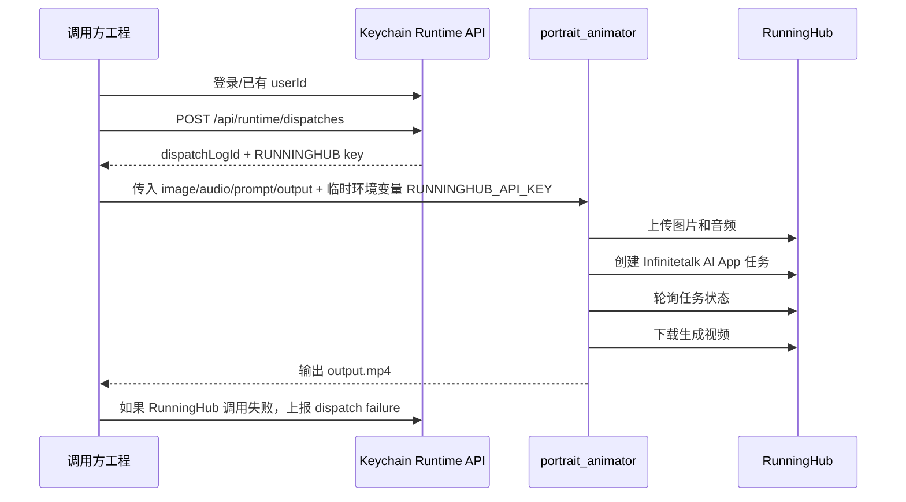

# Infinitetalk 视频生成接入说明

本文档说明其他工程如何复用本项目的 Infinitetalk 口播视频生成功能。

当前实现使用 RunningHub AI 应用生成视频。调用方需要先从 Keychain Runtime API 获取一次性 RunningHub 密钥，然后把该密钥仅用于本次 Infinitetalk 调用。调用结束后不要保存密钥，下次生成视频前重新申请。

## 一、整体流程



关键约束：

- 每次生成视频前都调用 Keychain 申请一次 key。
- 申请到的 key 只传给当前一次 RunningHub 调用。
- 不要把 RunningHub key 写入配置文件、数据库、日志或用户态持久化文件。
- 如果 RunningHub 调用失败，使用本次 `dispatchLogId` 上报失败原因。

## 二、Keychain 申请一次性密钥

### 1. 查询 provider 和 model

Infinitetalk 使用的 provider/model 当前是：

```text
providerName: runninghub
modelName: infinitetalk
```

推荐流程是动态查询 ID，不要在调用方硬编码：

```http
GET /api/runtime/providers
Authorization: Bearer <RUNTIME_API_TOKEN>
```

找到 `name` 为 `runninghub` 的 provider 后，查询模型：

```http
GET /api/runtime/models?providerId=<runninghubProviderId>
Authorization: Bearer <RUNTIME_API_TOKEN>
```

找到 `name` 为 `infinitetalk` 的 model。

### 2. 申请 key

```http
POST /api/runtime/dispatches
Authorization: Bearer <RUNTIME_API_TOKEN>
Content-Type: application/json
```

请求体：

```json
{
  "channelName": "ai_video_maker",
  "userId": "user_xxx",
  "providerId": "provider_xxx",
  "modelId": "model_xxx"
}
```

响应：

```json
{
  "dispatchLogId": "dispatch_xxx",
  "providerName": "runninghub",
  "modelName": "infinitetalk",
  "keyId": "key_xxx",
  "keyAlias": "runninghub-main",
  "key": "<RUNNINGHUB_API_KEY>"
}
```

`key` 即本次调用要传给 RunningHub 的 API Key。它只能用于当前一次调用。

### 3. 失败上报

如果 RunningHub 调用失败，调用方应上报：

```http
POST /api/runtime/dispatches/{dispatchLogId}/failure
Authorization: Bearer <RUNTIME_API_TOKEN>
Content-Type: application/json
```

请求体：

```json
{
  "errorCode": "provider_error",
  "errorMessage": "RunningHub returned error message"
}
```

推荐错误码：

| 错误码 | 场景 |
| --- | --- |
| `timeout` | 上传、创建任务、轮询或下载超时 |
| `unauthorized` | RunningHub 返回鉴权失败或 key 无效 |
| `rate_limit` | RunningHub 返回限流或额度不足 |
| `network_error` | 网络连接失败 |
| `provider_error` | 其他 RunningHub 业务错误 |

注意：如果是调用方自己的参数错误，例如图片路径不存在、音频路径不存在，不需要上报为 provider failure。

## 三、直接调用工具

本项目的工具文件：

```text
tools/portrait_animator.py
```

打包后的 Windows exe：

```text
tools/dist/portrait_animator/portrait_animator.exe
```

### 环境变量

调用前设置：

```text
RUNNINGHUB_API_KEY=<Keychain dispatch 返回的 key>
RUNNINGHUB_BASE_URL=https://www.runninghub.cn
```

`RUNNINGHUB_BASE_URL` 可选，默认是 `https://www.runninghub.cn`。

### 命令行参数

```bash
python tools/portrait_animator.py \
  --image C:/path/portrait.jpg \
  --audio C:/path/speech.mp3 \
  --prompt "人物在说话" \
  --max-size 1280 \
  --output C:/path/output.mp4
```

Windows exe 调用：

```powershell
$env:RUNNINGHUB_API_KEY = "<one-shot-key>"
tools\dist\portrait_animator\portrait_animator.exe `
  --image "C:\path\portrait.jpg" `
  --audio "C:\path\speech.mp3" `
  --prompt "人物在说话" `
  --max-size 1280 `
  --output "C:\path\output.mp4"
Remove-Item Env:\RUNNINGHUB_API_KEY
```

参数说明：

| 参数 | 必填 | 默认值 | 说明 |
| --- | --- | --- | --- |
| `--image` | 是 | 无 | 人像图片路径，建议 jpg/png |
| `--audio` | 是 | 无 | 音频路径，建议 mp3/wav/aac |
| `--output` | 是 | 无 | 输出视频路径 |
| `--prompt` | 否 | `人物在说话` | 运动提示词 |
| `--max-size` | 否 | `1280` | 输出最长边尺寸 |
| `--jitter` | 否 | `0` | 抖动强度 |
| `--zoom` | 否 | `1.0` | 缩放大小 |
| `--timeout` | 否 | `36000` | RunningHub 任务轮询超时，单位秒 |
| `--poll-interval` | 否 | `3` | 轮询间隔，单位秒 |
| `--base-url` | 否 | 环境变量或默认值 | RunningHub API 地址 |
| `--api-key` | 否 | 环境变量 | RunningHub API Key。更推荐用环境变量传入 |

工具 stdout 会输出进度信息：

```text
进度: 5%
[PortraitAnimator] 上传图片: ...
[PortraitAnimator] 上传音频: ...
[PortraitAnimator] API_SUBMITTED
[PortraitAnimator] 状态: 生成中
进度: 100%
Output: C:/path/output.mp4
Success: 视频已生成 → C:/path/output.mp4
```

调用方可以监听：

- `进度: <n>%`：更新任务进度。
- `[PortraitAnimator] API_SUBMITTED`：表示 RunningHub 任务已提交，此时可释放本地并发槽。
- `Output: <path>`：最终输出文件。

进程退出码：

- `0`：成功。
- 非 `0`：失败，错误信息通常以 `Error:` 开头。

## 四、Node.js 封装示例

下面示例展示一个独立工程如何完成 Keychain dispatch、调用工具、失败上报和密钥销毁。

```ts
import { spawn } from 'node:child_process';

interface DispatchResult {
  dispatchLogId: string;
  providerName: string;
  modelName: string;
  key: string;
}

async function keychainRequest<T>(
  baseUrl: string,
  runtimeToken: string,
  path: string,
  init: RequestInit = {},
): Promise<T> {
  const res = await fetch(`${baseUrl}${path}`, {
    ...init,
    headers: {
      Authorization: `Bearer ${runtimeToken}`,
      'Content-Type': 'application/json',
      ...(init.headers || {}),
    },
  });
  const data = await res.json().catch(() => ({}));
  if (!res.ok) {
    const message = data?.error?.message || data?.message || `HTTP ${res.status}`;
    const code = data?.error?.code ? ` (${data.error.code})` : '';
    throw new Error(`${message}${code}`);
  }
  return data as T;
}

async function dispatchInfinitetalkKey(params: {
  keychainBaseUrl: string;
  runtimeToken: string;
  channelName: string;
  userId: string;
  providerId: string;
  modelId: string;
}): Promise<DispatchResult> {
  return keychainRequest<DispatchResult>(
    params.keychainBaseUrl,
    params.runtimeToken,
    '/api/runtime/dispatches',
    {
      method: 'POST',
      body: JSON.stringify({
        channelName: params.channelName,
        userId: params.userId,
        providerId: params.providerId,
        modelId: params.modelId,
      }),
    },
  );
}

function runPortraitAnimator(params: {
  exePath: string;
  imageFile: string;
  audioFile: string;
  outputPath: string;
  prompt?: string;
  maxSize?: number;
  runninghubApiKey: string;
}): Promise<void> {
  return new Promise((resolve, reject) => {
    const args = [
      '--image', params.imageFile,
      '--audio', params.audioFile,
      '--output', params.outputPath,
    ];
    if (params.prompt) args.push('--prompt', params.prompt);
    if (params.maxSize) args.push('--max-size', String(params.maxSize));

    const child = spawn(params.exePath, args, {
      shell: false,
      windowsHide: true,
      env: {
        ...process.env,
        PYTHONIOENCODING: 'utf-8',
        PYTHONUTF8: '1',
        RUNNINGHUB_API_KEY: params.runninghubApiKey,
      },
    });

    const stdout: string[] = [];
    const stderr: string[] = [];

    child.stdout.on('data', (chunk) => {
      const text = chunk.toString('utf8');
      stdout.push(text);
      process.stdout.write(text);
    });
    child.stderr.on('data', (chunk) => {
      const text = chunk.toString('utf8');
      stderr.push(text);
      process.stderr.write(text);
    });

    child.on('error', reject);
    child.on('close', (code) => {
      if (code === 0) return resolve();
      reject(new Error([...stdout, ...stderr].join('').trim() || `portrait_animator exited with ${code}`));
    });
  });
}

async function reportDispatchFailure(params: {
  keychainBaseUrl: string;
  runtimeToken: string;
  dispatchLogId: string;
  error: unknown;
}) {
  const message = params.error instanceof Error ? params.error.message : String(params.error || 'unknown error');
  const errorCode = /timeout|超时/i.test(message)
    ? 'timeout'
    : /401|unauthorized|invalid.?key/i.test(message)
      ? 'unauthorized'
      : /429|rate.?limit|quota/i.test(message)
        ? 'rate_limit'
        : /network|ENOTFOUND|ECONNREFUSED/i.test(message)
          ? 'network_error'
          : 'provider_error';

  await keychainRequest(
    params.keychainBaseUrl,
    params.runtimeToken,
    `/api/runtime/dispatches/${encodeURIComponent(params.dispatchLogId)}/failure`,
    {
      method: 'POST',
      body: JSON.stringify({ errorCode, errorMessage: message }),
    },
  );
}

export async function generateInfinitetalkVideo(params: {
  keychainBaseUrl: string;
  runtimeToken: string;
  channelName: string;
  userId: string;
  providerId: string;
  modelId: string;
  portraitAnimatorExePath: string;
  imageFile: string;
  audioFile: string;
  outputPath: string;
  prompt?: string;
  maxSize?: number;
}) {
  const dispatch = await dispatchInfinitetalkKey({
    keychainBaseUrl: params.keychainBaseUrl,
    runtimeToken: params.runtimeToken,
    channelName: params.channelName,
    userId: params.userId,
    providerId: params.providerId,
    modelId: params.modelId,
  });

  try {
    await runPortraitAnimator({
      exePath: params.portraitAnimatorExePath,
      imageFile: params.imageFile,
      audioFile: params.audioFile,
      outputPath: params.outputPath,
      prompt: params.prompt,
      maxSize: params.maxSize,
      runninghubApiKey: dispatch.key,
    });
    return { outputPath: params.outputPath };
  } catch (error) {
    await reportDispatchFailure({
      keychainBaseUrl: params.keychainBaseUrl,
      runtimeToken: params.runtimeToken,
      dispatchLogId: dispatch.dispatchLogId,
      error,
    });
    throw error;
  } finally {
    dispatch.key = '';
  }
}
```

## 五、当前项目内的对应实现

本项目内相关文件：

| 文件 | 作用 |
| --- | --- |
| `app/src/main/services/keychain-runtime.ts` | Keychain Runtime API：登录用户、查询模型、dispatch key、失败上报 |
| `app/src/main/ipc/task.ts` | `task:generateVideoInfinitetalk` IPC 入口，校验资源并创建输出文件 |
| `app/src/main/services/python-bridge.ts` | `runInfinitetalkVideo`，启动 `portrait_animator` |
| `tools/portrait_animator.py` | 调用 RunningHub Infinitetalk AI App |
| `tools/runninghub_video.py` | RunningHub API 客户端、上传、创建任务、轮询、下载 |

本项目的调用入口参数：

```ts
{
  draftId: string;
  imageResourceId: string;
  audioResourceId: string;
  prompt?: string;
  maxSize?: number;
  targetSectionId?: string;
  taskId?: string;
}
```

如果另一个工程没有本项目的草稿/资源系统，可以直接使用文件路径级别的参数：

```ts
{
  imageFile: string;
  audioFile: string;
  outputPath: string;
  prompt?: string;
  maxSize?: number;
}
```

## 六、常见错误

| 错误 | 含义 | 处理方式 |
| --- | --- | --- |
| `no available key (DISPATCH_KEY_FAILED)` | Keychain 没有可分发的 RunningHub/Infinitetalk key | 检查 Keychain 后台该 channel/provider/model 下是否有 enabled + available 的 key |
| `RunningHub API Key 未配置` | 没有把 dispatch 返回的 key 传给工具 | 确认 `RUNNINGHUB_API_KEY` 环境变量或 `--api-key` |
| `文件不存在` | 图片或音频路径错误 | 调用前检查输入文件 |
| `文件大小超过 10MB 限制` | RunningHub 上传限制 | 压缩输入图片/音频 |
| `任务超时（36000秒）` | RunningHub 任务长时间未完成 | 检查 RunningHub 任务状态或提高 `--timeout` |
| `队列已满` | RunningHub 队列满 | 等待后重试 |

## 七、接入检查清单

- [ ] 调用方有 Keychain `baseUrl`、`channelName`、`runtimeToken`。
- [ ] 用户能登录或调用方能拿到合法 `userId`。
- [ ] 能查询到 `runninghub` provider 和 `infinitetalk` model。
- [ ] 每次生成前调用 `/api/runtime/dispatches`。
- [ ] 只把 dispatch 返回的 key 传给当前子进程。
- [ ] 子进程结束后清空内存中的 key 引用。
- [ ] provider 调用失败时上报 `/failure`。
- [ ] 不在日志中打印 key。
- [ ] 输出目录存在且可写。
